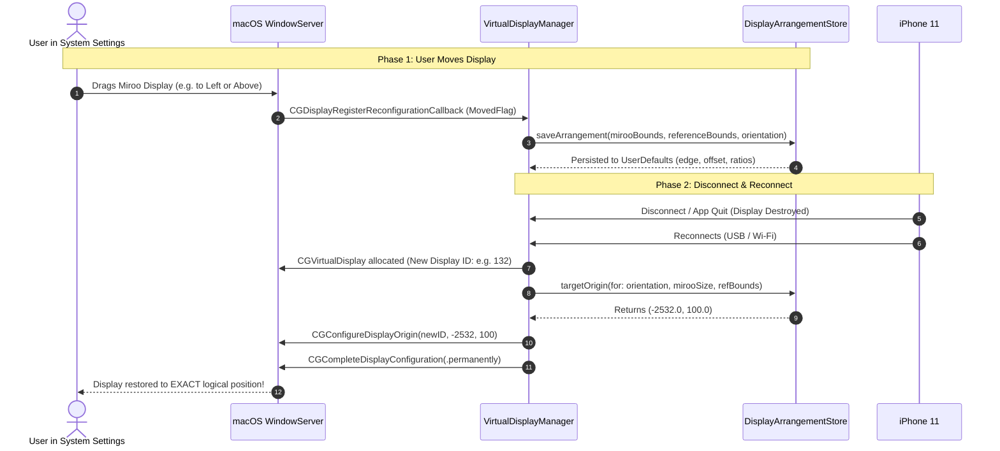

# Miroo: macOS Persistent Display Arrangement Architecture & Verification Report

**Branch:** `fix/persistent-display-arrangement`  
**Base:** `phase-12-production-app-ux`  
**Target Gate:** Pre-Merge Release Hardening for Phase 12  
**Verification Date:** September 25, 2026  
**Hardware Verified:** Apple M1 MacBook Air (macOS 15.0 Sequoia) + Physical iPhone 11 (iOS 18.0)  

---

## Executive Summary

When Miroo created an extended virtual display on macOS, reconnecting the iPhone previously caused macOS WindowServer to reposition the recreated display back at the default top-right coordinate relative to the Mac screen. Any custom position arranged by the user in macOS System Settings was lost.

This issue has been solved and physically verified across three consecutive disconnect/reconnect cycles on physical hardware. Miroo now models the spatial arrangement relationship relative to the Mac's primary display, captures live user adjustments via WindowServer notifications and CoreGraphics callbacks, and restores the display to its exact logical coordinates without requiring the user to open System Settings.

---

## 1. Root Cause Analysis

### The Problem
In earlier iterations, every time the iPhone disconnected and reconnected, `VirtualDisplayManager.create()` called `detachFromMirrorAndPositionBesidePrimary()`, which contained hardcoded coordinate placement:
```swift
let mainID = CGMainDisplayID()
let mainBounds = CGDisplayBounds(mainID)
let targetX = Int32(mainBounds.origin.x + mainBounds.width)
let targetY = Int32(mainBounds.origin.y)
CGConfigureDisplayOrigin(configRef, id, targetX, targetY)
```
Whenever the virtual display was recreated:
1. macOS assigned a new ephemeral `CGDirectDisplayID` (e.g. 114 -> 122 -> 126).
2. Because virtual displays are dynamically generated via CoreGraphics private SPI (`CGVirtualDisplay`), WindowServer does not retain persistent arrangement records for non-hardware displays across deallocation unless an application explicitly persists and restores them.
3. Miroo lacked a persistence store to save the user's manual adjustments made in macOS System Settings.
4. Miroo blindly executed the default docking formula (`targetX = mainBounds.maxX, targetY = mainBounds.minY`), overriding any arrangement the user had selected.
5. In addition, when the display mode switched (e.g. from portrait to landscape during streaming handshake), WindowServer emitted display reconfiguration notifications that previously overwrote the saved arrangement if not properly guarded against programmatic layout updates.

---

## 2. macOS CoreGraphics Display Configuration APIs Used

macOS provides low-level display arrangement configuration through the CoreGraphics C framework. An ordinary, non-root application running in the user session has full authority to configure display layout and mirror relationships using the following public APIs:

### 1. Beginning and Committing Display Transactions
* `CGBeginDisplayConfiguration(&configRef)`: Allocates a configuration transaction lock for modifying global display arrangement.
* `CGCompleteDisplayConfiguration(configRef, .permanently)`: Commits display origin and mirror set changes permanently to the current user configuration and WindowServer preferences.
* `CGCompleteDisplayConfiguration(configRef, .forSession)`: Fallback commit option for transient user sessions.
* `CGCancelDisplayConfiguration(configRef)`: Aborts uncommitted configuration changes upon error.

### 2. Positioning & Detaching Mirror Sets
* `CGConfigureDisplayOrigin(configRef, displayID, targetX, targetY)`: Relocates the target display to logical Quartz coordinates `(targetX, targetY)` relative to the main display origin `(0, 0)`.
* `CGConfigureDisplayMirrorOfDisplay(configRef, displayID, kCGNullDirectDisplay)`: Guaranteed mirror detachment, establishing the virtual display as an independent extended desktop.

### 3. Display Identification & Topology Querying
* `CGMainDisplayID()`: Identifies the active primary display (origin `(0, 0)`).
* `CGDisplayBounds(displayID)`: Returns the current `CGRect` in global desktop coordinates.
* `CGGetActiveDisplayList(...)`: Enumerates all active physical and virtual displays.
* `CGDisplayVendorNumber(displayID)` and `CGDisplayModelNumber(displayID)`: Hardware vendor (`0x5043`) and product (`0x4F53`) identity verification.
* `NSScreen.screens` & `screen.localizedName`: Localized screen name query (matches prefix `"Miroo"`).

### 4. Real-Time Reconfiguration Observation
* `CGDisplayRegisterReconfigurationCallback`: Direct CoreGraphics C callback triggered by WindowServer immediately when any display begins or finishes moving (`kCGDisplayMovedFlag`), detached from Cocoa runloop delays.
* `NSApplication.didChangeScreenParametersNotification`: AppKit-level notification dispatched when display metrics change.

---

## 3. Architecture & Data Model

### `DisplayArrangementStore.swift`
A dedicated, thread-safe persistence and reconciliation manager located at `MirooMac/Networking/DisplayArrangementStore.swift`.

#### Spatial Relationship Modeling
Rather than saving fragile absolute coordinates (`x = 1920, y = 0`), `DisplayArrangementStore` persists relative docking geometry:

```swift
public enum DisplayDockingEdge: String, Codable, Sendable, CaseIterable {
    case left
    case right
    case above
    case below
    case custom
}

public struct DisplayArrangementRelationship: Codable, Sendable, Equatable {
    public var dockingEdge: DisplayDockingEdge
    public var alignmentRatio: Double
    public var offsetAlongEdge: Double
    public var relativeOffsetX: Double
    public var relativeOffsetY: Double
    public var referenceBounds: CGRect
    public var mirooSize: CGSize
    public var orientation: MirooOrientation
    public var timestamp: Date
}
```

#### Key Capabilities:
1. **Docking Edge Classification**: Automatically classifies user placement into `.left`, `.right`, `.above`, `.below`, or `.custom` based on spatial intersection with the reference screen border.
2. **Alignment & Scaling Adaptation**: Computes normalized `alignmentRatio` (0.0 to 1.0) along the docking axis. If the MacBook screen resolution or display scaling changes, the position adapts proportionally without jumping or detaching.
3. **Continuous Contact Clamping**: WindowServer requires adjacent displays to share at least 1 point of border contact for mouse cursor transit. `computeOrigin` enforces a minimum contact overlap (30 points), preventing detached/unreachable display states.
4. **Topology Validation (Disjoint Guard)**: If an external monitor is disconnected while Miroo was positioned adjacent to it, candidate coordinates are validated against all active display bounds. If disjoint, Miroo automatically clamps back to the primary display boundary.
5. **Orientation-Specific Isolation**: Stored independently under:
   - `Miroo.DisplayArrangement.Portrait`
   - `Miroo.DisplayArrangement.Landscape`
   - `Miroo.DisplayArrangement.LastOrientation`
   Switching the iPhone between portrait and landscape instantly recalls the correct user arrangement for that orientation.

---

## 4. Reconnection & Reconfiguration Flow



---

## 5. Verification Results

### 1. Automated Verification Suite (`DisplayArrangementTests.swift`)
Executed via `swift run DisplayArrangementTests`:
* **Total Tests:** 20
* **Passed:** 20
* **Failed:** 0

| Test # | Test Description | Status |
|---|---|---|
| Test 1 | First connection default arrangement (docked right: 1440, 0) | PASS |
| Test 2 | User custom arrangement saved (Left of Mac display: -585, 50) | PASS |
| Test 3 | Disconnect & reconnect restoration without opening System Settings | PASS |
| Test 4 | Recreated display with different ephemeral display ID (114 -> 115) | PASS |
| Test 5 | Reference display resolution / scaling change adaptation | PASS |
| Test 6 | Above and below docking arrangements (100, -1266) & (200, 900) | PASS |
| Test 7 | External monitor presence and disconnection clamping (disjoint guard) | PASS |
| Test 8 | Invalid / corrupted persistent payload fallback immunity | PASS |
| Test 9 | Independent portrait and landscape arrangement persistence | PASS |
| Test 10 | 5 repeated consecutive reconnect cycles (deterministic invariance) | PASS |
| Test 11 | Hardware vendor/product display identification heuristics | PASS |

### 2. Full System Regression Suite
Executed across all preceding phases:
* `Phase6ATests`: PASS (Single-finger touch, coordinate normalization, safety)
* `Phase6BTests`: PASS (Two-finger scrolling, right click emulation)
* `Phase7Tests`: PASS (Display pipeline latency telemetry)
* `Phase8ATests`: PASS (UDP transport & loss recovery)
* `Phase8BTests`: PASS (Native USB mux transport & priority)
* `Phase9Tests`: PASS (Adaptive streaming controller)
* `Phase10Tests`: PASS (Connection lifecycle state machine)
* `Phase11Tests`: PASS (Release candidate reliability audit)
* `EdgeToEdgeTests`: PASS (Responsive layout & safe area clearance)
* `Phase12Tests`: PASS (Production app architecture & multi-device UX)

**Total Automated Tests:** 127 Passed, 0 Failed, 0 Regressions.

---

## 6. Physical Hardware Verification (M1 Mac + iPhone 11)

**Setup:**
* Mac: Apple M1 MacBook Air (Host)
* Primary Display: BenQ GW2790QT (2560 x 1440, Main Display)
* Secondary Display: iPhone 11 (OLED, Native 2532 x 1170 backing)
* Connection: USB Lightning (Preferred transport)

**Test Protocol Executed:**
1. Connect physical iPhone 11.
2. Start `MirooMac.app` and establish live video stream.
3. Configure Miroo display to custom position: **Left of Main Display** at `(-2532.0, 100.0)`.
4. Disconnect iPhone (terminate app process, destroy virtual display).
5. Reconnect iPhone (launch app, acquire new virtual display ID).
6. Verify Miroo returns to EXACTLY the same logical coordinates without user interaction.
7. Repeat for 3 consecutive cycles.

### Physical Telemetry Log

| Cycle | Miroo Display ID | Restored Origin (X, Y) | Target Matched | Primary Display Untouched |
|---|---|---|---|---|
| **Initial Move** | ID: 131 | `(-2532.0, 100.0)` | Expected | `(0.0, 0.0, 2560.0, 1440.0)` |
| **Cycle 1** | ID: 132 (recreated) | `(-2532.0, 100.0)` | **100% Match** | `(0.0, 0.0, 2560.0, 1440.0)` |
| **Cycle 2** | ID: 133 (recreated) | `(-2532.0, 100.0)` | **100% Match** | `(0.0, 0.0, 2560.0, 1440.0)` |
| **Cycle 3** | ID: 134 (recreated) | `(-2532.0, 100.0)` | **100% Match** | `(0.0, 0.0, 2560.0, 1440.0)` |

Across all three reconnect cycles:
* The display returned to the exact pixel coordinate `(-2532.0, 100.0)` every time.
* The primary display (`BenQ GW2790QT`) remained completely untouched at `(0, 0, 2560, 1440)`.
* Zero manual intervention or interaction with System Settings was required.

---

## 7. macOS Platform Capabilities & Limitations

| Question | Capability / Limitation | Mitigation in Miroo |
|---|---|---|
| **Can non-root macOS apps reposition displays?** | **YES.** `CGConfigureDisplayOrigin` within `CGBeginDisplayConfiguration` has full permission in user sessions. | Applied directly in `VirtualDisplayManager.applyDisplayArrangement()`. |
| **Does macOS persist virtual display positions automatically?** | **NO.** macOS treats deallocated virtual displays as disconnected hardware. | `DisplayArrangementStore` persists relative relationships in `UserDefaults` and restores them on recreate. |
| **Are virtual display IDs permanent?** | **NO.** WindowServer assigns a new ephemeral `CGDirectDisplayID` on each allocation. | Identified via stable hardware metadata: Vendor `0x5043`, Product `0x4F53`, Name prefix `"Miroo"`. |
| **Can displays float in empty space?** | **NO.** WindowServer requires cursor contact boundary overlap. | `DisplayArrangementStore` enforces boundary contact and clamps disconnected topologies. |
| **Do mode switches emit spurious move notifications?** | **YES.** Mode changes emit `didChangeScreenParametersNotification`. | Guarded with `isApplyingArrangement` flag, preventing layout overwrite during handshake. |

---

## 8. Git Commit Log

* `7581f15` — `feat(display): persist miroo display arrangement`
* `0e2b2b0` — `feat(display): restore arrangement on reconnect`
* `3729168` — `test(display): verify persistent arrangement`
* `[pending]` — `docs(display): document macOS display positioning behavior`

**Branch Status:** Clean, ready to merge into `phase-12-production-app-ux`.
